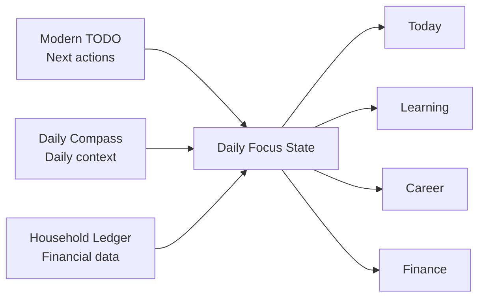
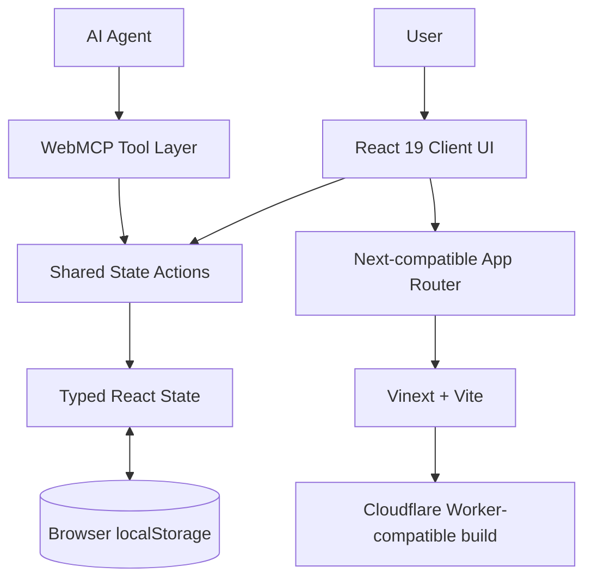
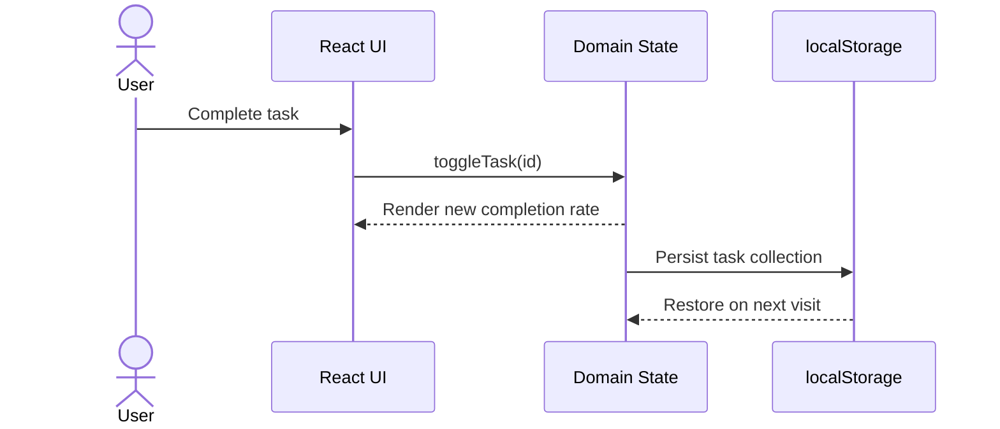
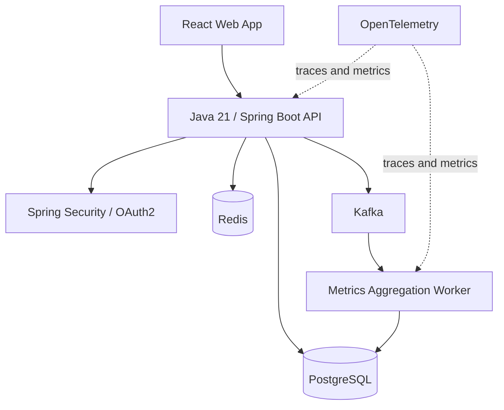

# Daily Focus — Personal OS

[](https://github.com/taeyoungk-dev/personal_dashboard/actions/workflows/ci.yml)
[](https://www.typescriptlang.org/)
[](https://react.dev/)
[](https://workers.cloudflare.com/)

> 장기 목표를 오늘 실행할 수 있는 행동으로 바꾸고, 그 과정을 데이터와 코드로 증명하는 개인 운영 대시보드

Daily Focus는 영어, 컴퓨터과학 학위, 소프트웨어 엔지니어 커리어, 중국어, 재정이라는 서로 다른 목표를 하나의 실행 시스템으로 연결합니다. 단순한 포트폴리오 소개 페이지가 아니라 매일 직접 사용하면서 성장 기록을 축적하도록 만든 **working product**입니다.

## Contents

- [Project overview](#project-overview)
- [Problem and solution](#problem-and-solution)
- [Core user journey](#core-user-journey)
- [Key features](#key-features)
- [Three projects, one system](#three-projects-one-system)
- [Architecture](#architecture)
- [Domain model](#domain-model)
- [Technical highlights](#technical-highlights)
- [Engineering decisions](#engineering-decisions)
- [Quality and accessibility](#quality-and-accessibility)
- [Run locally](#run-locally)
- [Project structure](#project-structure)
- [Roadmap](#roadmap)
- [Portfolio talking points](#portfolio-talking-points)

## Project overview

| Item | Detail |
| --- | --- |
| Project | Daily Focus — Personal OS |
| Type | 개인 생산성·학습·커리어·재정 통합 대시보드 |
| Status | Local-first MVP |
| Role | Product planning, UX/UI design, frontend architecture, implementation |
| Primary user | 미국 IT 커리어와 CS 학업을 함께 준비하는 개발자 |
| Core value | 장기 목표 → 이번 주 지표 → 오늘의 행동 → 포트폴리오 증거 연결 |
| Source projects | Household Account Book, Daily Compass, Modern TODO |
| Repository | [github.com/taeyoungk-dev/personal_dashboard](https://github.com/taeyoungk-dev/personal_dashboard) |

### Daily focus

> 수학으로 사고하고, 영어로 소통하고, 코드로 만들고, 시스템으로 확장하며, 데이터를 이해하는 글로벌 기술 인재

이 목표를 다음 다섯 개의 운영 영역으로 나눴습니다.

1. **English** — New TOEFL iBT Overall 5.5+와 Academic English 역량
2. **CS Degree** — 방송통신대학교 컴퓨터과학 학사와 GPA 4.2/4.5+
3. **Engineering** — Java Backend에서 Cloud·AI·Data, Security로 확장
4. **Portfolio** — GitHub 프로젝트, 설계 문서, 테스트, CI/CD로 역량 증명
5. **Financial runway** — 학업과 커리어 투자를 지속할 수 있는 재정 관리

## Problem and solution

### Problem

장기 목표를 여러 도구로 나누어 관리하면 다음 문제가 발생합니다.

- 할 일은 완료되지만 어느 장기 목표에 기여했는지 알기 어렵습니다.
- 학습 시간, 과목 진도, 시험 점수와 포트폴리오 결과물이 분리됩니다.
- 커리어 투자 비용이 생활 재정과 연결되지 않아 지속 가능성을 판단하기 어렵습니다.
- 기존 프로젝트가 각각 독립되어 있어 성장 과정과 기술 확장을 하나의 이야기로 보여주기 어렵습니다.

### Solution

Daily Focus는 모든 활동을 **목표 영역이 있는 실행 단위**로 모델링합니다.

```text
Long-term goal
      ↓
Quarter / semester milestone
      ↓
Weekly target and metric
      ↓
Today action
      ↓
Completion record / portfolio evidence
```

대시보드 첫 화면에서 오늘 해야 할 일, 이번 주의 흐름, 장기 목표 진척도와 재정 상태를 함께 확인할 수 있습니다. 사용자는 “무엇을 해야 하는가”뿐 아니라 “왜 이 일을 하는가”까지 한 화면에서 파악할 수 있습니다.

## Core user journey

1. **Orient** — 오늘 화면에서 핵심 과제와 장기 목표의 상태를 확인합니다.
2. **Plan** — 목표 영역, 우선순위, 예상 시간을 지정해 실행을 추가합니다.
3. **Execute** — 과제를 완료하고 하루 실행률을 즉시 갱신합니다.
4. **Review** — 주간 집중도, TOEFL 점수, CS 과목 진도와 SRS 유지율을 검토합니다.
5. **Prove** — 완료한 결과를 GitHub 프로젝트와 다음 기술 마일스톤으로 연결합니다.
6. **Sustain** — 교육·개발 지출과 남은 현금흐름을 확인해 계획의 지속 가능성을 관리합니다.

## Key features

### 1. Today — 목표를 오늘로 가져오는 홈

- 오늘의 실행률과 완료 개수 실시간 계산
- 연속 실행 일수와 주간 집중시간 요약
- 목표별 진행도를 보여주는 Daily Focus Map
- 2027 TOEFL 목표일부터 장기 글로벌 커리어까지 이어지는 Flight Plan
- 이번 달 수입·지출·잔액을 요약하는 Financial Runway

### 2. Execution — 목표 기반 할 일 관리

- 실행 이름, 목표 영역, 우선순위, 예상 시간 입력
- `TOEFL`, `CS`, `Career`, `Mandarin` 영역 분류
- 완료 상태 변경과 삭제
- 전체·진행 중·완료 필터
- 우선순위와 예정일을 함께 보여주는 실행 보드
- 완료 상태 변경 시 홈 화면의 실행률 자동 반영

### 3. Learning — 측정 가능한 학습 루프

- TOEFL Reading·Listening·Speaking·Writing 영역별 점수
- 주간 학습시간과 목표 달성률
- 25분 집중 세션 기록
- Active Recall과 SRS 기억 유지율
- 방통대 CS 4학기 교과 로드맵
- 자료구조, 선형대수, 컴퓨터구조 등 과목별 진행도

### 4. Career — Proof of Work 보드

- 세 원본 프로젝트와 통합 프로젝트의 계보 표시
- Backend, Data, Cloud, Security 목표 스택 시각화
- 다음 90일의 포트폴리오 증거 계획
- 각 프로젝트 저장소로 바로 이동할 수 있는 링크
- 구현된 기술과 향후 기술을 구분해 과장 없는 성장 서사 구성

### 5. Finance — 목표를 지지하는 가계부

- 수입·지출 거래 추가
- 전체 수입, 지출과 잔액 자동 계산
- 주거, 미래, 생활, 교육·개발 카테고리별 지출 비중
- OMSCS, 시험, 클라우드 실습을 위한 Career Fund 표시
- Java Swing 가계부의 거래 모델을 웹 기반 대시보드 경험으로 확장

### 6. Local-first persistence

다음 상태는 브라우저 `localStorage`에 저장됩니다.

- 실행 목록과 완료 상태
- 거래 내역
- 누적 학습시간
- 라이트·다크 테마 선택

서버 계정 없이 바로 사용할 수 있고 새로고침 후에도 상태가 유지됩니다. 현재 한계와 서버 이전 전략은 [Architecture Decision Record](docs/architecture.md)에 명시했습니다.

### 7. Agent-ready interface with WebMCP

지원 브라우저에서는 UI와 동일한 상태 변경 함수를 사용하는 WebMCP 도구를 제공합니다.

| Tool | Type | Purpose |
| --- | --- | --- |
| `list_open_actions` | Read | 완료되지 않은 실행 조회 |
| `complete_action` | Write | 지정한 실행 완료 처리 |
| `log_study_session` | Write | 학습시간을 분 단위로 기록 |

도구 입력은 JSON Schema로 제한하고 잘못된 ID와 시간 범위를 검증합니다. 화면과 에이전트가 서로 다른 비즈니스 로직을 사용하지 않도록 동일한 React 상태 액션에 연결했습니다.

## Three projects, one system

이 프로젝트는 기존 결과물을 단순히 한 저장소에 복사하지 않고, 각 프로젝트의 핵심 학습 결과를 하나의 제품 흐름으로 재설계했습니다.

| Source project | Original strengths | Integrated into Daily Focus | Improvement |
| --- | --- | --- | --- |
| [household-account-book](https://github.com/taeyoungk-dev/household-account-book) | Java Swing, Builder Pattern, CSV File I/O, transaction table | Finance, ledger, monthly cashflow | 웹 접근성, 반응형 UI, 실시간 집계, 커리어 투자 관점 추가 |
| [daily-compass](https://github.com/taeyoungk-dev/daily-compass) | React dashboard, Azure Functions, Cosmos DB, cloud architecture | Today dashboard, daily planning, career overview | 장기 목표·학업·재정 데이터 연결과 정보 구조 개선 |
| [todo-list-work](https://github.com/taeyoungk-dev/todo-list-work) | Vanilla JS state, filters, dark mode, localStorage | Execution board, theme, persistence | TypeScript 도메인 모델, 목표 영역, 우선순위, 시간 추정, 검색 추가 |

### Integration principle



## Architecture

### Current MVP



### Data flow



### Target production architecture



The current implementation and the target architecture are intentionally separated. Spring Boot, PostgreSQL, Redis and Kafka are the **next production phase**, not technologies claimed as already implemented.

## Domain model

### Task

```ts
type FocusTask = {
  id: number;
  title: string;
  meta: string;
  area: "TOEFL" | "CS" | "Career" | "Mandarin";
  priority: "high" | "medium" | "low";
  done: boolean;
  duration: string;
  due: string;
};
```

### Transaction

```ts
type Transaction = {
  id: number;
  title: string;
  category: string;
  type: "income" | "expense";
  amount: number;
  date: string;
};
```

### Planned backend bounded contexts

| Context | Aggregate roots | Representative events |
| --- | --- | --- |
| Execution | Goal, Task | `TaskCreated`, `TaskCompleted` |
| Learning | Course, StudySession, RecallItem | `StudySessionLogged`, `RecallReviewed` |
| Finance | Account, Transaction, Budget | `TransactionCreated`, `BudgetThresholdReached` |
| Career | Project, Evidence, Milestone | `EvidencePublished`, `MilestoneReached` |

## Technical highlights

### Typed domain state

기존 Vanilla JavaScript TODO를 TypeScript 모델로 전환했습니다. 목표 영역과 우선순위를 union type으로 제한해 잘못된 상태를 줄이고, 할 일과 거래 로직이 UI 문자열에 의존하지 않도록 구성했습니다.

### Shared mutation path

체크박스 클릭과 WebMCP 호출이 동일한 상태 변경 함수를 사용합니다. 이는 UI, 자동화, 향후 API 사이의 동작 불일치를 줄이는 구조입니다.

### Derived metrics

실행률, 완료율, 예정 시간, 수입, 지출과 잔액은 중복 저장하지 않고 원본 컬렉션에서 계산합니다. 파생 데이터를 별도로 저장하면서 발생할 수 있는 동기화 오류를 방지합니다.

### Design system

- CSS custom properties로 색상, surface, border, radius와 shadow 토큰 관리
- Navy·cobalt·lime 팔레트로 Mission Control 성격 표현
- Shadcn 기반 `Button`, `Dialog`, `Select`, `Tabs`, `Checkbox`, `Progress` 사용
- 공통 카드, 메트릭, 상태 배지와 반응형 그리드 패턴 적용

### Edge-compatible delivery

Next-compatible App Router 애플리케이션을 Vinext와 Vite로 빌드합니다. 결과물은 Cloudflare Workers 환경에서 실행할 수 있는 ESM Worker 형태로 생성됩니다.

### Continuous integration

GitHub Actions의 Quality Gate가 다음 작업을 자동화합니다.

```text
Checkout → Node.js 22 setup → npm ci → ESLint → Production build
```

## Engineering decisions

### Why localStorage first?

첫 버전의 목표는 서버 운영이 아니라 세 프로젝트의 핵심 경험을 빠르게 통합하고 실제로 사용하는 것이었습니다. 인증과 인프라 없이 제품 가설을 확인한 뒤, 데이터 접근 경계를 유지하면서 Spring Boot API로 이전하는 전략을 선택했습니다.

### Why one dashboard instead of separate tools?

할 일, 학습, 커리어, 재정을 각각 최적화하면 사용자는 정보를 직접 연결해야 합니다. Daily Focus는 오늘의 행동이 어떤 학습 목표와 커리어 증거로 이어지는지 보여주는 데 제품 가치를 두었습니다.

### Why not add Kafka and Redis immediately?

현재 데이터 규모에서는 이벤트 브로커와 캐시가 문제를 해결하지 않습니다. 사용자 동기화와 서버 집계가 실제 요구가 되는 단계에서 측정 가능한 성능·확장성 문제를 근거로 도입합니다.

### Trade-offs

| Decision | Benefit | Cost |
| --- | --- | --- |
| Local-first persistence | 설치 없이 즉시 사용, 낮은 운영 비용 | 기기 간 동기화와 계정별 데이터 격리 불가 |
| Single-page workspace | 빠른 전환과 전체 목표 맥락 유지 | 기능 증가 시 route/module 분리 필요 |
| Derived dashboard metrics | 단일 진실 공급원 유지 | 데이터가 커지면 서버 집계 필요 |
| Edge-compatible build | 빠른 정적 자산 제공과 간단한 배포 | Java 백엔드는 별도 서비스로 운영해야 함 |

더 자세한 확장 순서는 [docs/architecture.md](docs/architecture.md)에서 확인할 수 있습니다.

## Quality and accessibility

- 시맨틱 heading, navigation, button, form label 사용
- 모든 아이콘 버튼에 접근 가능한 이름 제공
- Dialog focus management와 키보드 조작 지원
- `Cmd/Ctrl + K` 빠른 검색 단축키
- 모바일 drawer navigation
- 410px, 680px, 860px, 1180px 반응형 breakpoint
- 본문 확대와 좁은 화면을 고려한 flexible grid
- `prefers-reduced-motion` 지원
- 라이트·다크 테마 모두 동일한 의미 토큰 사용
- ESLint와 production build 기반 자동 검증

## Run locally

### Requirements

- Node.js `22.13.0` 이상
- npm

### Installation

```bash
git clone https://github.com/taeyoungk-dev/personal_dashboard.git
cd personal_dashboard
npm ci
```

### Development server

```bash
npm run dev
```

브라우저에서 [http://localhost:5173](http://localhost:5173)을 엽니다.

### Quality checks

```bash
npm run lint
npm run build
```

### Available scripts

| Command | Purpose |
| --- | --- |
| `npm run dev` | Vinext/Vite 개발 서버 실행 |
| `npm run lint` | ESLint 정적 검사 |
| `npm run build` | Cloudflare Worker-compatible production build |
| `npm run start` | 빌드된 Worker 로컬 실행 |

## Project structure

```text
personal_dashboard/
├── .github/workflows/
│   └── ci.yml                 # Lint/build quality gate
├── .openai/
│   └── hosting.json           # Sites deployment manifest
├── app/
│   ├── globals.css            # Design tokens and responsive styles
│   ├── layout.tsx             # Metadata and root layout
│   └── page.tsx               # Domain state, views and interactions
├── components/ui/             # Accessible Shadcn primitives
├── docs/
│   └── architecture.md        # ADR and production evolution
├── public/
│   └── favicon.svg            # Daily Focus brand mark
├── types/
│   └── webmcp.d.ts            # Browser WebMCP type declarations
├── package.json
└── vite.config.ts             # Vinext and Cloudflare build configuration
```

## Roadmap

### Phase 1 — Integrated MVP ✅

- [x] 목표 중심 대시보드
- [x] 실행 CRUD와 필터
- [x] 학습 지표와 세션 기록
- [x] 포트폴리오 증거 보드
- [x] 수입·지출과 현금흐름
- [x] Local-first persistence
- [x] WebMCP tools
- [x] 반응형 UI와 CI quality gate

### Phase 2 — Java backend

- [ ] Java 21 / Spring Boot REST API
- [ ] OpenAPI 기반 frontend-backend contract
- [ ] PostgreSQL, JPA, Flyway migration
- [ ] Spring Security OAuth2/OIDC
- [ ] 사용자별 데이터 격리와 validation
- [ ] Testcontainers 기반 integration test

### Phase 3 — Scale and intelligence

- [ ] Redis dashboard aggregation cache
- [ ] Kafka domain events and metrics worker
- [ ] OpenTelemetry logs, metrics and traces
- [ ] 학습 패턴 분석과 취약 영역 추천
- [ ] 월간 회고와 목표 달성 예측
- [ ] Docker and automated deployment pipeline

## Portfolio talking points

면접이나 포트폴리오 설명에서는 다음 순서로 소개할 수 있습니다.

1. **문제 정의** — 서로 분리된 목표와 세 개의 기존 프로젝트를 하나의 실제 사용 제품으로 연결했습니다.
2. **제품 판단** — 장기 계획을 보여주는 데 그치지 않고 오늘의 실행을 첫 화면의 중심에 배치했습니다.
3. **기술 판단** — 빠른 검증을 위해 local-first로 시작하되 서버 이전 경계를 명확히 설계했습니다.
4. **코드 품질** — TypeScript 도메인 모델, 파생 상태, 접근 가능한 UI primitive, CI quality gate를 적용했습니다.
5. **확장성** — Spring Boot, PostgreSQL, Redis와 Kafka를 문제 발생 순서에 맞춰 도입하는 로드맵을 문서화했습니다.
6. **차별점** — WebMCP를 통해 사람과 AI 에이전트가 같은 실행 시스템을 사용할 수 있도록 했습니다.

## Current limitations

- 데이터는 현재 브라우저와 기기에만 저장됩니다.
- 예시 학습 점수와 과목 진행도는 정적 샘플 데이터입니다.
- 계정, 동기화, 알림과 서버 분석 기능은 아직 포함하지 않습니다.
- 다중 사용자 협업과 권한 제어는 Phase 2 범위입니다.

제약을 숨기지 않고 다음 기술 단계와 연결함으로써, 구현된 범위와 계획된 범위를 명확히 구분했습니다.

## Author

**김태영**

Backend · Cloud · Data Engineer in progress

- GitHub: [@taeyoungk-dev](https://github.com/taeyoungk-dev)
- LinkedIn: [linkedin.com/in/taeyoung-kim-9b743140b](https://www.linkedin.com/in/taeyoung-kim-9b743140b/)
- Tech Blog: [taeyoungkim.dev/ko](https://www.taeyoungkim.dev/ko)
- Email: [taeyoungkdev@gmail.com](mailto:taeyoungkdev@gmail.com)
