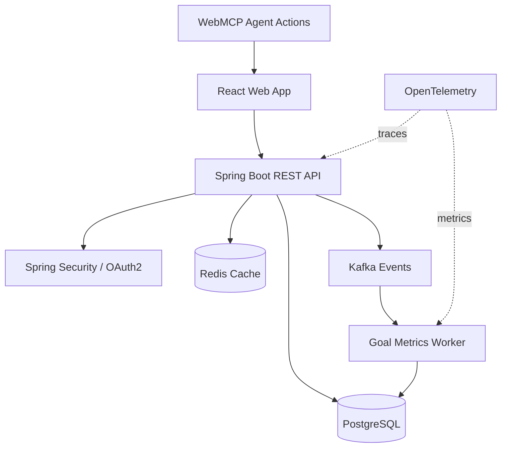

# Architecture Decision Record

## ADR-001: Ship the integrated MVP as local-first

**Status:** Accepted

**Date:** 2026-09-13

### Context

The three source applications use different persistence and delivery models: CSV in a Java desktop app, Azure Functions/Cosmos DB in a React cloud app, and browser storage in a Vanilla JavaScript TODO app. The integrated product must be immediately usable while also demonstrating an intentional path toward the target Java backend stack.

### Decision

The first release uses typed React domain models and localStorage-backed state. All user mutations pass through a small set of state actions. WebMCP tools call the same actions as the visible UI.

This keeps the MVP deployable as an edge application without credentials or infrastructure while preserving a clean seam for a server API.

### Consequences

- The app works offline after initial load and requires no account setup.
- Data is device-local and is not synchronized across browsers.
- Authentication, authorization, relational constraints, and server-side analytics are deliberately out of MVP scope.
- A production migration can replace storage calls without redesigning the interaction model.

## Target production architecture

### Bounded contexts

| Context | Aggregate roots | Representative events |
| --- | --- | --- |
| Execution | Goal, Task | TaskCreated, TaskCompleted |
| Learning | Course, StudySession, RecallItem | StudySessionLogged, RecallReviewed |
| Finance | Account, Transaction, Budget | TransactionCreated, BudgetThresholdReached |
| Career | Project, Evidence, Milestone | EvidencePublished, MilestoneReached |

### Migration sequence

1. Extract local persistence behind repository interfaces.
2. Add Spring Boot endpoints with OpenAPI contracts.
3. Introduce PostgreSQL migrations and per-user foreign keys.
4. Add OAuth2 identity and row-level authorization checks.
5. Publish domain events for asynchronous metric aggregation.
6. Add Redis only after measuring dashboard aggregation latency.

This order keeps complexity proportional to verified product needs and turns each infrastructure addition into a demonstrable engineering decision.
